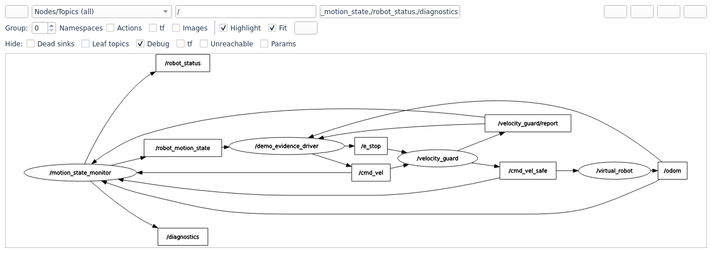

# cmd_vel_safety

基于 **ROS 2 Humble / C++17** 的差速机器人速度指令安全网关与运动状态监控系统。

项目在上游 `/cmd_vel` 与底盘之间加入 `velocity_guard`，对原始速度指令进行校验、限幅和加减速限制，并在指令超时、持续非法输入或急停时输出停车指令。配套的虚拟底盘与独立监控节点支持无硬件演示、rosbag 回放和离线验证。

交付仓库：[Irsatyn/cmd_vel_safety](https://github.com/Irsatyn/cmd_vel_safety)。运行证据、完整录屏与复现方法见 [运行证据](#运行证据)，AI 辅助范围见 [AI 使用说明](#ai-使用说明)。

## 功能

- **输入校验**：拒绝 NaN / Inf，识别不可执行自由度，通过后续帧确认大幅跳变，过滤孤立毛刺。
- **速度处理**：前进与倒车独立限幅、角速度限幅、横向加速度耦合限制、死区处理及加减速限制。
- **失效处理**：指令超时刹车、持续非法输入安全保持、急停状态控制；虚拟底盘具有独立看门狗。
- **状态监控**：运动状态分类、指令频率、断流、里程计新鲜度和速度跟踪误差监控。
- **可追溯性**：逐周期发布原始输入、有效目标、实际输出、干预标志和原因。
- **验证工具**：内置测试 rosbag、算法回归测试与节点集成测试、全链路录制及离线校验脚本。

## 目录

- [环境要求](#环境要求)
- [快速开始](#快速开始)
- [系统架构](#系统架构)
- [运行方式](#运行方式)
- [参数配置](#参数配置)
- [急停与 QoS](#急停与-qos)
- [测试与验证](#测试与验证)
- [运行证据](#运行证据)
- [AI 使用说明](#ai-使用说明)
- [常见问题](#常见问题)
- [项目结构](#项目结构)
- [开发与文档](#开发与文档)
- [许可证](#许可证)

## 环境要求

| 项目 | 要求 |
| --- | --- |
| 操作系统 | Ubuntu 22.04；WSL2 环境的通信说明见常见问题 |
| ROS | ROS 2 Humble，已配置软件源并安装 |
| 构建工具 | 支持 C++17 的编译器、CMake、colcon、rosdep |
| 脚本运行 | Python 3；包依赖通过 rosdep 安装 |
| 图形演示 | 可用的图形桌面或 WSLg，以及 rqt_graph / rqt_plot |

## 快速开始

### 1. 克隆仓库

```bash
git clone https://github.com/Irsatyn/cmd_vel_safety.git
cd cmd_vel_safety
```

仓库根目录就是 colcon 工作空间。后续构建、测试和配置命令均在此目录执行。GitHub 上的源码包含两个完整 ROS 包及其消息定义、Launch、配置和测试数据；下载 ZIP 后解压到任意工作目录，也可从该目录按下述步骤编译。Git Commit History 需要通过 Git 克隆查看。

### 2. 安装依赖

```bash
source /opt/ros/humble/setup.bash
sudo apt update
sudo apt install python3-colcon-common-extensions python3-rosdep
```

如果这台机器尚未初始化 rosdep，先执行一次 `sudo rosdep init`。已初始化的机器直接执行：

```bash
rosdep update
rosdep install --from-paths src --ignore-src --rosdistro humble -r -y
```

### 3. 构建并加载环境

```bash
colcon build --symlink-install
source install/setup.bash
```

每个新终端都需要加载 ROS 与工作空间环境。可在仓库根目录执行：

```bash
source /opt/ros/humble/setup.bash
source install/setup.bash
```

### 4. 回放演示数据

```bash
ros2 launch cmd_vel_safety replay_bag.launch.py
```

该命令启动安全网关、虚拟底盘和监控节点，并回放仓库内的 `/cmd_vel` 测试数据。回放使用 `/clock` 驱动节点的仿真时间。

在另一个已加载环境的终端中查看状态：

```bash
ros2 topic echo /robot_status
```

示例状态文本：

```text
[FORWARD 2.40s] v=+0.30 m/s  w=+0.00 rad/s  R=inf  | dist=1.85 m | cmd_in=10.00 Hz safe_out=20.00 Hz | interventions=14 | OK: nominal
```

## 系统架构

```text
上游 / rosbag ── /cmd_vel ──► velocity_guard ── /cmd_vel_safe ──► virtual_robot
                                  ▲      │                             │
                               /e_stop   │ /velocity_guard/report      │ /odom
                                         ▼                             ▼
                                          motion_state_monitor
                                            │          │          │
                                 /robot_motion_state /robot_status /diagnostics
```

监控节点同时订阅 `/cmd_vel`、`/cmd_vel_safe`、安全报告和里程计，独立测量通信频率并比较指令与实际速度。

| 节点 | 默认频率 | 职责 |
| --- | --- | --- |
| `velocity_guard` | 20 Hz | 校验输入、处理有效目标、定时发布安全速度与报告 |
| `virtual_robot` | 50 Hz | 模拟差速底盘与电机滞后，发布里程计和 TF |
| `motion_state_monitor` | 5 Hz | 分类运动状态，发布结构化状态、文字状态和诊断 |

`MotionState.velocity_source` 明确标记速度来源：`SOURCE_ODOMETRY` 表示有效里程计，`SOURCE_COMMAND` 表示使用新鲜指令估计，`SOURCE_UNKNOWN` 表示两者均已失效。未知时发布 `STATE_UNKNOWN`，不把缺少数据当作已确认静止。异常里程计会被拒绝并报告诊断，恢复正常后继续累计有效里程。监控节点的 `publish_rate_hz` 支持动态调整。

升级后需重新构建自定义消息包及其消费者。

### 主要接口

| Topic | 消息类型 | 发布者 → 订阅者 | 用途 |
| --- | --- | --- | --- |
| `/cmd_vel` | `geometry_msgs/msg/Twist` | 上游 / rosbag → 网关、监控 | 原始速度输入 |
| `/e_stop` | `std_msgs/msg/Bool` | 急停控制端 → 网关 | 急停置位 / 解除 |
| `/cmd_vel_safe` | `geometry_msgs/msg/Twist` | 网关 → 底盘、监控 | 底盘执行的速度指令 |
| `/velocity_guard/report` | `cmd_vel_safety_msgs/msg/SafetyReport` | 网关 → 监控、观测工具 | 逐周期安全处理记录 |
| `/odom` | `nav_msgs/msg/Odometry` | 底盘 → 监控、观测工具 | 实际或模拟的运动反馈 |
| `/robot_motion_state` | `cmd_vel_safety_msgs/msg/MotionState` | 监控 → 用户程序 | 运动状态与链路健康 |
| `/robot_status` | `std_msgs/msg/String` | 监控 → 终端 / 用户程序 | 人可读状态 |
| `/diagnostics` | `diagnostic_msgs/msg/DiagnosticArray` | 监控 → 诊断工具 | ROS 诊断信息 |

辅助接口：虚拟底盘发布 `/tf`；bag 回放发布 `/clock`，开启 `use_sim_time` 的节点以其作为时间基准。

差速底盘输出仅使用 `linear.x` 与 `angular.z`。安全报告包含同一控制周期对应的 `input_cmd`、`target_cmd`、`output_cmd` 和节点时钟时间戳，便于定位干预原因与校验输出变化。

## 运行方式

以下命令按用途独立运行。

### 回放与图形演示

```bash
# 放慢回放
ros2 launch cmd_vel_safety replay_bag.launch.py rate:=0.3

# 循环回放；节点会处理仿真时钟回跳
ros2 launch cmd_vel_safety replay_bag.launch.py loop:=true

# 回放并打开 rqt_graph 与 rqt_plot，需要图形界面
ros2 launch cmd_vel_safety demo.launch.py
```

也可以在运行中的系统上单独打开可视化工具：

```bash
rqt_graph
rqt_plot /cmd_vel/linear/x /cmd_vel_safe/linear/x /velocity_guard/report/flags
```

### 录制全链路

```bash
ros2 launch cmd_vel_safety record_bag.launch.py output:=/tmp/cmd_vel_safety_run
```

启动脚本会先开始录制，再回放数据。回放完成后按 `Ctrl+C` 停止 launch，让录制进程关闭并完成 bag 写入。每次录制使用新的输出目录。录制器使用 `--use-sim-time`，其消息时间戳与控制循环使用同一 `/clock`。

### 接入实时指令

```bash
# 使用虚拟底盘，接收实时 /cmd_vel
ros2 launch cmd_vel_safety bringup.launch.py

# 使用真实底盘，关闭虚拟底盘
ros2 launch cmd_vel_safety bringup.launch.py enable_virtual_robot:=false
```

真实底盘应订阅 `/cmd_vel_safe`，并通过 `/odom` 提供运动反馈。网关输出的是速度指令，实际停车行为由底盘执行；底盘侧仍应具备自己的指令超时处理。

## 参数配置

默认配置位于 [src/cmd_vel_safety/config/params.yaml](src/cmd_vel_safety/config/params.yaml)。

| 参数 | 默认值 | 含义 |
| --- | --- | --- |
| `control_rate_hz` | `20.0` | 网关输出频率，Hz |
| `max_linear_x` / `min_linear_x` | `1.0` / `-0.3` | 前进 / 倒车速度边界，m/s |
| `max_angular_z` | `1.5` | 角速度幅值上限，rad/s |
| `max_linear_accel` / `max_linear_decel` | `0.8` / `1.5` | 线加速 / 减速上限，m/s² |
| `max_angular_accel` / `max_angular_decel` | `2.0` / `3.0` | 角加速 / 减速上限，rad/s² |
| `max_lateral_accel` | `1.2` | 目标及最终输出的横向加速度上限 `abs(v * ω)`，m/s² |
| `cmd_timeout` | `0.5` | 原始指令超时时间，s |
| `max_consecutive_invalid` | `5` | 进入非法输入安全保持的连续帧数 |
| `emergency_decel_factor` | `2.0` | 超时 / 安全保持时的减速倍率 |
| `estop_hard_stop` | `true` | 急停时直接将输出指令归零 |

监控节点的关键参数：`publish_rate_hz=5.0` 控制状态发布频率，`signal_lost_timeout=1.0` 判定原始指令及安全指令新鲜度，`odom_stale_timeout=1.0` 判定反馈失效，`tracking_error_warn=0.15` 控制线速度跟踪误差告警阈值。虚拟底盘使用 `update_rate_hz=50.0`、`linear_time_constant=0.15`、`angular_time_constant=0.10` 模拟电机响应，并用自己的 `cmd_timeout=0.5` 实现独立停车保护。

使用自定义配置文件启动：

```bash
ros2 launch cmd_vel_safety bringup.launch.py \
  params_file:="$(pwd)/src/cmd_vel_safety/config/params.yaml"
```

支持运行时调整的限幅参数可直接修改：

```bash
ros2 param set /velocity_guard max_linear_x 0.4
ros2 param list /velocity_guard
ros2 param describe /velocity_guard max_lateral_accel
```

启动与运行时更新使用相同的参数校验。例如，`cmd_timeout` 必须至少覆盖两个控制周期。如果新速度或横向加速度上限无法容纳当前输出，更新会被拒绝，并提示先减速或停车后重设。拒绝后保留原配置。

输出平滑也受 `abs(v * ω)` 约束：先完成允许的减速，再分配增速空间，同时竞争预算时优先线速度。反向运动先按减速度到零，再用剩余周期按加速度反向起步。硬急停可以直接输出零指令。

Topic 名称和 QoS 参数为只读启动参数，修改 YAML 后需要重启节点。

## 急停与 QoS

`/e_stop` 默认使用 **Reliable + TransientLocal** 订阅。匹配的发布者可以保存急停状态，让晚启动的网关获取已经置位的急停。

**Volatile 发布者无法匹配 TransientLocal 订阅者。** 普通 `ros2 topic pub` 默认使用 Volatile，需要显式设置 QoS：

```bash
# 置位急停，保持发布者运行
ros2 topic pub /e_stop std_msgs/msg/Bool '{data: true}' \
  --qos-durability transient_local --qos-reliability reliable
```

解除前先用 `Ctrl+C` 停止上面的发布者，再执行：

```bash
ros2 topic pub /e_stop std_msgs/msg/Bool '{data: false}' \
  --qos-durability transient_local --qos-reliability reliable
```

演示时使用单个急停发布者，避免多个发布者持续发送相反状态。急停解除会清空目标速度，需要新的有效速度指令才能恢复运动。

TransientLocal 的历史由发布者保存。保持发布者存活，才能让之后启动的网关获取保留状态；使用 `--once` 后退出不能提供这一保证。

如果上游只能发布 Volatile 消息，可在 YAML 中将 `velocity_guard.ros__parameters.estop_qos_durability` 改为 `"volatile"`，通过 `params_file` 加载并重启。此时仍要求 Reliable 发布者，且无法获取启动前的历史急停状态。

## 测试与验证

### 算法单元测试

```bash
colcon test --packages-select cmd_vel_safety
colcon test-result --verbose
```

也可直接运行构建后的测试程序：

```bash
./build/cmd_vel_safety/test_safety_limiter
```

24 项算法测试覆盖输入校验、毛刺确认、限幅、加减速、超时、急停及状态重置等行为。核心算法独立于 `rclcpp`，测试通过显式输入时间和控制周期验证结果。另有 19 项离线校验器回归和 6 项实进程集成测试，覆盖参数、Topic 连接、异常反馈、诊断和动态频率。

### 录制结果离线校验

完成全链路录制后，在仓库根目录执行：

```bash
ros2 run cmd_vel_safety check_bag.py /tmp/cmd_vel_safety_run \
  --params "$(pwd)/src/cmd_vel_safety/config/params.yaml" \
  --strict --reference-bag src/cmd_vel_safety/bags/cmd_vel
```

`--params` 应指向本次运行使用的参数文件。脚本检查输出有限性、速度边界、横向加速度、不可执行自由度、输出连续性与看门狗停车行为。

连续性校验使用控制周期采样的 `header.stamp` 与 `output_cmd`，分别检查普通加速、普通制动、紧急制动及跨零反向；硬急停豁免斜率限制，但仍必须输出零。

`--strict` 检查控制报告连续性、时间基准以及原始输入断流后的看门狗和停车行为。报告必须覆盖录到的输入时段，端点允许一个控制周期加 20 ms 的记录延迟；停车期限根据断流后的实际输出速度和紧急减速度计算，另允许两个控制周期（最少 40 ms）的记录延迟。报告间隔超过 1 s 与两个控制周期中的较大值时，判为无法验证；1 Hz 控制的正常周期可以通过。`--reference-bag` 还比较原始输入数量、顺序和内容，可以发现 320 帧只录到 310 帧的情况。安全输出与报告的数量、内容也必须一致。

旧录制不加 `--strict` 时可做逐点与连续性检查，无法验证的项会显示 `UNCHECKED`。严格断流审计使用单次、同钟录制；循环回放请逐轮单独录制。运行时调参的数据需按配置变化拆分后检查。

### 场景覆盖

仓库内的 bag 包含 320 帧原始指令，时长约 35.9 s，通常以 10 Hz 发布，覆盖正常运动、倒车、持续超限、NaN / Inf、孤立毛刺、不可执行自由度和断流。

历史验证记录见 [docs/scenario.md](docs/scenario.md)：回放覆盖 11 类安全标志中的 8 类；死区、持续非法输入和急停另有在线测试记录。该文档保存既有实测数据，新环境的结果请通过上述命令复核。

## 运行证据

本仓库包含实际运行的图像、视频及消息记录；使用 ROS 2 Humble、CycloneDDS 和虚拟底盘。

- [完整运行录屏（H.264 MP4）](docs/evidence/full_run.mp4)：从节点启动开始，连续展示输入、目标、输出曲线、里程计、运动状态、rqt_graph 和真实启动日志，最后停车并关闭节点。GitHub 文件页可下载视频。
- [rqt_graph 运行截图](docs/evidence/rqt_graph.png)及[运行拓扑 JSON](docs/evidence/runtime_graph.json)：由运行中的 ROS 图查询得到。
- [场景验证结果](docs/evidence/results.json)、[逐周期报告](docs/evidence/reports.jsonl)和[进程日志](docs/evidence/launch.log)：供独立复核。
- [视频时间索引、录制环境与复现方法](docs/evidence/README.md)。



演示使用额外的 `/demo_evidence_driver` 发布测试指令并观察消息；产品节点仍是网关、虚拟底盘和监控三个节点。录屏直接采集运行中的演示窗口，没有用静态图动画替代实际运行，也没有真实硬件制动测试。

现有有意义提交包含：`e182973` 添加 ROS 2 项目与测试数据、`01aef7e` 重写 README、`9e194f1` 修正安全约束及验证逻辑；交付证据在后续独立提交中保存，未为满足数量要求拆分空提交。

## AI 使用说明

本项目使用 OpenAI Codex 辅助系统设计、C++ 与 Python 代码修改、边界问题分析、回归测试、ROS 2 运行验证、Git 操作和文档整理。安全限速修正、参数校验、状态来源与 UNKNOWN 行为、离线审计及演示采集工具包含 AI 辅助实现。

用户提供任务要求、确认修改方案并授权本地合并。AI 在本机实际执行构建、测试、节点运行和录屏，文档中的运行结论以对应日志和数据为依据；没有把 AI 生成的示意结果当作实测证据。源码、参数、复现命令和提交历史均公开，便于审阅 AI 辅助产生的修改。

AI 仅参与开发与验证流程，机器人运行时不调用大模型或外部 AI 服务，速度处理由本地 C++ 节点确定性执行。

## 常见问题

### WSL2 / 多网卡环境下节点收不到消息

项目开发环境曾出现默认 FastDDS 下多进程无法通信的问题，ROS 自带的 talker / listener 也受影响；切换 CycloneDDS 后恢复通信。这是特定环境的记录，是否需要切换应根据当前环境判断。

可安装 CycloneDDS 的 RMW 实现后重试：

```bash
sudo apt install ros-humble-rmw-cyclonedds-cpp
ros2 daemon stop
export RMW_IMPLEMENTATION=rmw_cyclonedds_cpp
```

所有参与运行的终端使用一致的 RMW 配置，然后重新启动节点和回放进程。切换 RMW 或 `ROS_DOMAIN_ID` 后，停止旧的 ROS CLI daemon 可避免沿用旧配置。

### 急停消息已发布，网关却没有响应

检查双方 QoS，尤其是 durability 和 reliability：

```bash
ros2 topic info /e_stop --verbose
```

默认急停订阅要求 Reliable + TransientLocal，发布命令见 [急停与 QoS](#急停与-qos)。

### 无法启动 rqt 图形窗口

`demo.launch.py` 需要图形界面。无桌面环境时使用 `replay_bag.launch.py`，通过 `/robot_status`、`/velocity_guard/report` 和离线录制检查运行结果。

`ros2 node info` 可核对发布与订阅声明；是否实际收到消息，还需结合 `ros2 topic echo`、频率观测和录制数据判断。

## 项目结构

```text
cmd_vel_safety/
├── .gitattributes
├── .gitignore
├── README.md
├── LICENSE                        Apache-2.0 许可证
├── CONTRIBUTING.md                开发与验证约定
├── tools/capture_demo.py           完整演示录屏与证据采集
├── docs/
│   ├── design.md                   架构与安全规则设计
│   ├── scenario.md                 场景标注与历史实测结果
│   ├── verification.md             安全修正验收记录
│   ├── plans/                      开发方案与交付清单
│   └── evidence/                   完整 MP4、运行截图与数据
└── src/
    ├── cmd_vel_safety_msgs/        自定义消息接口包
    │   ├── CMakeLists.txt
    │   ├── package.xml
    │   └── msg/
    │       ├── SafetyReport.msg
    │       └── MotionState.msg
    └── cmd_vel_safety/             节点、算法与工具
        ├── CMakeLists.txt
        ├── package.xml
        ├── include/cmd_vel_safety/safety_limiter.hpp
        ├── src/
        │   ├── safety_limiter.cpp
        │   ├── velocity_guard_node.cpp
        │   ├── motion_state_monitor_node.cpp
        │   └── virtual_robot_node.cpp
        ├── launch/                启动、回放、录制和图形演示
        ├── config/params.yaml
        ├── scripts/check_bag.py
        ├── test/                 算法、校验器与实进程回归
        └── bags/cmd_vel/          随仓库保留的测试数据
```

`src/` 按 ROS 2 包组织，`docs/` 保存项目文档与证据，`tools/` 保存开发辅助工具。`build/`、`install/` 和 `log/` 由 colcon 生成，已通过 `.gitignore` 排除；它们不属于可移植源码，下载后重新构建即可生成。源码目录内的测试 bag 随仓库版本管理。

## 开发与文档

- [系统设计](docs/design.md)：架构、消息、参数、安全流水线与异常处理。
- [场景与实测记录](docs/scenario.md)：测试 bag 逐段标注、干预结果与验证范围。
- [贡献说明](CONTRIBUTING.md)：目录约定、构建及提交验证。
- [Issues](https://github.com/Irsatyn/cmd_vel_safety/issues)：问题反馈与改进建议。

提交算法修改时，请补充对应边界场景并运行构建与测试。问题反馈请附 ROS 版本、运行命令、参数文件以及相关日志或录制数据。

## 许可证

项目采用 **Apache-2.0** 许可证，完整文本见 [LICENSE](LICENSE)。两个 ROS 包的 `package.xml` 声明与之保持一致。
