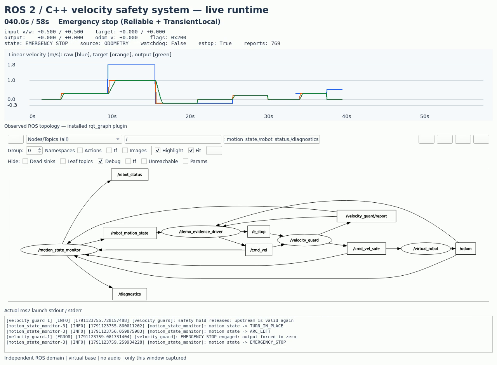

# 完整运行录屏与证据

[播放 / 下载完整视频](full_run.mp4) · [运行图截图](rqt_graph.png) · [场景检查](results.json)



本次视频为连续的 **58.1 秒 H.264 MP4**，1280 × 940、10 FPS、无音轨。画面来自实际运行的 Qt 演示窗口：ROS Topic 数据、安装的 rqt_graph 插件和真实 `ros2 launch` 日志。仅采集该窗口；没有采集其他桌面窗口，也没有使用合成动画。图刷新短暂阻塞时保留上一实际帧，保持录屏与真实时间一致。

环境为 ROS 2 Humble、CycloneDDS、独立 `ROS_DOMAIN_ID=181` 和虚拟底盘；C++ 实现对应提交 `9e194f1`。额外的 `/demo_evidence_driver` 只负责演示输入和观测，并非新的产品节点。

## 视频时间索引

| 时间 | 内容 | 观察重点 |
|---|---|---|
| 0–4 s | 节点启动、零指令 | 真实启动日志与反馈建立 |
| 4–10 s | 正常前进 | 输入 / 目标 / 输出及里程计收敛 |
| 10–16 s | 线速度、角速度超限及侧向指令 | 限幅、耦合预算与不可执行自由度标志 |
| 16–21 s | 倒车 | 跨零制动后反向加速 |
| 21–26 s | 原始输入断流 | 看门狗触发并停车 |
| 26–30 s | 新指令恢复 | 从停止状态重新运动 |
| 30–34 s | 连续 NaN / Inf | 拒绝非法输入并进入安全保持 |
| 34–38 s | 连续有效指令恢复 | 解除安全保持 |
| 38–42 s | 急停 | 急停报告及零输出 |
| 42–45 s | 解除急停，暂不发新速度 | 旧目标不恢复 |
| 45–50 s | 新速度指令 | 正常重新运动 |
| 50–54 s | 死区指令、停车 | 最终输出归零 |
| 54–58 s | 验证结果与关闭节点 | 所有场景通过、进程正常结束 |

## 可复核文件

| 文件 | 用途 |
|---|---|
| [full_run.mp4](full_run.mp4) | 完整连续录屏；全部 581 帧已解码验证 |
| [rqt_graph.png](rqt_graph.png) / [rqt_graph.dot](rqt_graph.dot) | 运行中 rqt_graph 的实际截图及其 DOT 数据 |
| [runtime_graph.json](runtime_graph.json) | 查询得到的各 Topic 发布 / 订阅节点 |
| [reports.jsonl](reports.jsonl) | 1,049 条实际报告，包含时间、场景、input/target/output 和标志 |
| [results.json](results.json) | 12 项场景检查全部通过；观察到 11/11 安全标志 |
| [launch.log](launch.log) | 三节点启动、状态变化及关闭的真实日志 |
| [final_state.png](final_state.png) | 最后停车阶段的窗口 |
| [manifest.json](manifest.json) | 环境、视频尺寸 / 时长和文件 SHA-256 |
| [published_verification.json](published_verification.json) | 发布快照的 GitHub 文件、提交历史和实际视频下载校验 |

非法输入在 JSON 中以字符串 `nan` / `inf` 表示，以保持标准 JSON 可解析。
本次检查以实时报告验证演示场景，不替代全部算法测试或源 bag 的严格完整性审计；完整回归与 bag 审计方法见根目录 README。

## 复现

先按根目录 README 构建项目。录屏工具额外需要 Qt、OpenCV 和 rqt_graph：

```bash
sudo apt install python3-pyqt5 python3-opencv ros-humble-rqt-graph \
  ros-humble-rmw-cyclonedds-cpp
source /opt/ros/humble/setup.bash
source install/setup.bash
export RMW_IMPLEMENTATION=rmw_cyclonedds_cpp
export ROS_DOMAIN_ID=181
python3 tools/capture_demo.py /tmp/cmd_vel_demo_new
```

需要可用的图形显示，输出目录必须不存在。工具自动启动与关闭自己的三个节点，58 秒后生成视频、图像、拓扑、日志和检查结果；结果不通过时返回非零退出码。不要在演示中提前关闭窗口。H.264 编码器需在 OpenCV 构建中可用，本机已确认支持。
